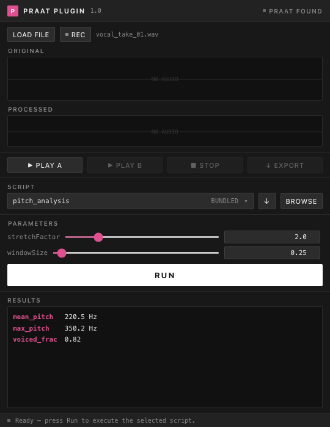

<p align="center">
  
</p>

<h1 align="center">PraatPlugin</h1>

<p align="center">
  A VST3 / AU plugin that runs <a href="https://www.praat.org">Praat</a> scripts on audio — from inside your DAW.
</p>

<p align="center">
  <a href="https://praatplugin.netlify.app">🌐 praatplugin.netlify.com</a>
</p>

<p align="center">
  
  
  
  
  
</p>

<p align="center">
  
</p>

---

Load a take, drag-select the region you care about, pick a script from a library of 300+, tweak the parameters, and hit **Run** — the processed audio appears as a second waveform ready to play or export.

Great for voice and speech work, music production, phonetics research, or anywhere you want Praat's analysis and processing power without leaving your DAW.

---

## Table of Contents

- [Features](#features)
- [Download](#download)
- [Requirements](#requirements)
- [Building from source](#building-from-source)
- [Scripts](#scripts)
- [Writing your own scripts](#writing-your-own-scripts)
- [UI overview](#ui-overview)
- [Architecture](#architecture)
- [Contributing](#contributing)
- [Acknowledgements](#acknowledgements)
- [License](#license)

---

## Features

- **Load or record audio** directly inside the plugin window
- **Drag a region** on the waveform to process only a subset
- **Browse 300+ community scripts** organized by category — pitch, distortion, reverb, spectral, spatial, granular, and more
- **Adjust script parameters** live with sliders, toggles, and dropdowns — values are read directly from the script's `form` block
- **Run** — runs Praat in headless mode and shows the result waveform
- **Compare** original and processed audio with the built-in transport
- **Export** the processed audio as a WAV file

---

## Download

Pre-built binaries are available on the [Releases](https://github.com/Ron-312/PraatPlugin/releases) page.

| Platform | Format | Notes |
|---|---|---|
| macOS 12+ | VST3 + AU | Universal binary (Apple Silicon & Intel) |
| Windows 10+ | VST3 | Requires [WebView2 Runtime](https://developer.microsoft.com/en-us/microsoft-edge/webview2/) |

After downloading, copy the plugin to your DAW's plugin folder and rescan.

---

## Requirements

| Dependency | Notes |
|---|---|
| **macOS 12+ / Windows 10+** | See [Download](#download) for format details |
| **Praat** | Download free from [praat.org](https://www.praat.org). The plugin searches standard locations automatically. |
| **DAW** | Any DAW that loads VST3 or AU plugins (Ableton Live, Logic Pro, Reaper, etc.) |

### Build requirements

| Tool | Platform | Version |
|---|---|---|
| CMake | All | 3.22 or later |
| Xcode Command Line Tools | macOS | Any recent version |
| Visual Studio 2022 (with C++ workload) | Windows | 17+ |
| Node.js + npm | All | For rebuilding the UI only |

---

## Building from source

### macOS

```bash
# 1. Clone
git clone https://github.com/Ron-312/PraatPlugin.git
cd PraatPlugin

# 2. Build the React UI (only needed when ui/src changes)
cd ui && npm install && npm run build && cd ..

# 3. Configure and build the plugin
cmake -B build -DCMAKE_BUILD_TYPE=Release
cmake --build build --config Release

# 4. Deploy to system plugin folders
cp -R build/PraatPlugin_artefacts/Release/VST3/PraatPlugin.vst3 \
      ~/Library/Audio/Plug-Ins/VST3/
cp -R build/PraatPlugin_artefacts/Release/AU/PraatPlugin.component \
      ~/Library/Audio/Plug-Ins/Components/
```

After deploying, rescan plugins in your DAW.

### Windows

The plugin uses JUCE's `WebBrowserComponent` backed by WebView2, which requires the **Microsoft.Web.WebView2 NuGet package** to be present at build time. This is not installed by default.

**Step 1 — Install the WebView2 SDK** (one-time, run in PowerShell):

```powershell
Register-PackageSource -provider NuGet -name nugetRepository `
    -location https://www.nuget.org/api/v2 -Force

Install-Package Microsoft.Web.WebView2 -Scope CurrentUser `
    -RequiredVersion 1.0.3485.44 -Source nugetRepository -Force
```

This installs the package to `%LOCALAPPDATA%\PackageManagement\NuGet\Packages\`.

**Step 2 — Build:**

```bash
# Clone
git clone https://github.com/Ron-312/PraatPlugin.git
cd PraatPlugin

# Build the React UI (only needed when ui/src changes)
cd ui && npm install && npm run build && cd ..

# Configure — point JUCE at the NuGet packages folder
cmake -B build -DJUCE_WEBVIEW2_PACKAGE_LOCATION="%LOCALAPPDATA%\PackageManagement\NuGet\Packages"
cmake --build build --config Release
```

The VST3 is output to `build\PraatPlugin_artefacts\Release\VST3\PraatPlugin.vst3`. Copy it to `%COMMONPROGRAMFILES%\VST3\` or your DAW's VST3 scan folder, then rescan.

> [!NOTE]
> `JUCE_WEBVIEW2_PACKAGE_LOCATION` must point to the **parent** folder that *contains* the `Microsoft.Web.WebView2.*` directory — not to the package folder itself. If you pass the wrong path, CMake will report "Found WebView2" but the build will fail with `Cannot open include file: 'WebView2.h'`.

---

## Scripts

### Community library (300+ scripts)

On first run the plugin automatically downloads the full [Praat-plugin_AudioTools](https://github.com/ShaiCohen-ops/Praat-plugin_AudioTools) library by Shai Cohen directly from GitHub. Scripts are saved to `~/Library/Application Support/PraatPlugin/community_scripts/` and loaded organized by category:

| Category | Examples |
|---|---|
| Analysis | formant analysis, pitch statistics, voiced fraction |
| Pitch | pitch shift, vibrato, pitch correction, robot voice |
| Distortion | fuzz, wavefolder, soft clip, tanh saturation |
| Reverb | shimmer reverb, convolution reverb, room simulation |
| Spectral | spectral tilt, harmonic enhancement, spectral freeze |
| Time & Granular | paulstretch, time stretch, granular scatter |
| Spatial & Surround | stereo widener, phaser, chorus |
| Modulation | tremolo, ring mod, AM/FM synthesis |
| Filter & Color | formant filter, resonant filter, EQ curves |
| Dynamics | compressor, limiter, gate |
| Generative & Synthesis | additive synth, noise shaping, IR generation |
| AI & Adaptive | adaptive pitch, ML-assisted transformations |

Hit the **↓** button next to the script selector at any time to update the library to the latest version from GitHub.

### Bundled scripts

Nine scripts ship embedded in the plugin and are extracted to `~/Library/Application Support/PraatPlugin/scripts/` on first run. These serve as working examples of the calling convention and as fallbacks if the download hasn't completed yet:

| Script | What it does |
|---|---|
| `pitch_analysis.praat` | Measures mean / min / max pitch and std deviation |
| `formant_analysis.praat` | Extracts F1–F4 formant frequencies at the midpoint |
| `pitch_shift.praat` | Transposes pitch by N semitones (PSOLA) |
| `robot_voice.praat` | Flattens pitch to a constant frequency (monotone effect) |
| `fuzz_distortion.praat` | Soft-clipping saturation via tanh curve |
| `stereo_phaser.praat` | LFO-modulated comb filter with stereo width |
| `spectral_reverb.praat` | Stochastic convolution reverb with synthesized IR |
| `wavefolder.praat` | Buchla-style wavefolding distortion |
| `paulstretch.praat` | Extreme time-stretch via FFT phase randomisation |

These scripts were adapted from Shai Cohen's library for use with the plugin's headless CLI calling convention.

### Browsing scripts

Click the script selector button to open the **Script Browser** — a searchable popup that shows all loaded scripts organized by folder. Filter by category on the left, search by name at the top, and click any script to select it.

Use **BROWSE** to load scripts from any local folder on your machine (useful if you have your own `.praat` files or a local clone of another script collection).

---

## Writing your own scripts

Scripts must follow a calling convention so the plugin can invoke them and build the parameter UI automatically:

```praat
form Pitch Shift
    sentence inputFile /tmp/input.wav
    sentence outputFile /tmp/output.wav
    real semitones 7.0
    positive windowLength 0.01
    boolean sharpen 0
    choice algorithm 1
        option PSOLA
        option Resample
endform

# Read the input file
Read from file: inputFile$

# ... your Praat processing code here ...

# Write the result to outputFile$ (plugin reads it back)
Write to WAV file: outputFile$

# Print key-value pairs — these appear in the Results panel
appendInfoLine: "semitones: ", semitones
appendInfoLine: "duration: ", Get total duration
```

**Rules:**

1. The script must have a `form`/`endform` block
2. The first two fields must be `sentence inputFile` and `sentence outputFile` — the plugin fills these in automatically
3. Any additional fields become interactive controls in the plugin UI:
   - `real` / `positive` / `natural` / `integer` → slider + number input
   - `boolean` → ON/OFF toggle
   - `choice` / `optionmenu` → dropdown menu
   - `sentence` / `word` / `text` → text input
4. Write the processed audio to `outputFile$` — the plugin reads it back and shows it as the processed waveform
5. Print results as `KEY: value` lines to the Praat info window — they appear in the Results panel

See `scripts/examples/` for working examples of each pattern. The [Praat-plugin_AudioTools](https://github.com/ShaiCohen-ops/Praat-plugin_AudioTools) repo is also a great reference for more advanced script patterns.

---

## UI overview

```
┌─────────────────────────────────────────────┐
│  PRAAT PLUGIN                    ● Ready    │  ← header + Praat status
├─────────────────────────────────────────────┤
│  [Load File]  [● Record]  [■ Stop]          │  ← audio controls
│  ▓▓▓▓▓▓▓▓▓░░░░░░░░░░░░░░░░░░░▓▓▓▓▓▓▓▓▓▓  │  ← original waveform (drag to select)
│  ░░░░░░░░░░░░░▓▓▓▓▓▓▓▓▓▓▓░░░░░░░░░░░░░░  │  ← morphed waveform
├─────────────────────────────────────────────┤
│  [▶ Original] [▶ Processed] [■ Stop] [↓ Export]│
├─────────────────────────────────────────────┤
│  SCRIPT  [pitch_shift   PITCH ▾] [↓] [BROWSE]│  ← ↓ downloads/updates from GitHub
│                                             │
│  PARAMETERS                                 │
│  semitones  ●───────────────────  [7.0   ] │
├─────────────────────────────────────────────┤
│  [              ▶  RUN                    ] │
├─────────────────────────────────────────────┤
│  RESULTS                                    │
│  semitones    7.0                           │
│  duration     2.34 s                        │
└─────────────────────────────────────────────┘
```

Clicking the script selector opens the **Script Browser** — a full-screen overlay with category filtering and search across all 300+ scripts.

The window is resizable — drag any edge to make it taller or wider (420–900 × 480–1400 px).

---

## Project structure

```
PraatPlugin/
├── src/
│   ├── plugin/          # JUCE AudioProcessor + WebView editor
│   ├── audio/           # Live capture (ring buffer) + WAV writer
│   ├── praat/           # Praat locator, runner, form parser
│   ├── jobs/            # Analysis job queue + dispatcher
│   ├── scripts/         # Script manager, downloader, parameter parser
│   ├── results/         # Result parser (key-value extraction)
│   └── ui/              # WaveformDisplay component
├── ui/                  # React app (Vite, single-file bundle)
│   └── src/
│       ├── components/  # Header, AudioSection, Transport, ScriptBrowser, etc.
│       ├── hooks/       # usePluginState (state + actions)
│       ├── bridge/      # juceBridge.js (JS ↔ C++ events)
│       └── styles/      # Design tokens + global CSS
├── legacy/              # Original JUCE-component editor (preserved)
├── scripts/examples/    # Bundled Praat scripts (adapted from Shai Cohen's library)
├── docs/adr/            # Architecture decision records
└── CMakeLists.txt
```

---

## Architecture

The UI is a React app embedded via JUCE's `WebBrowserComponent`. State flows in one direction:

```
C++ (20fps timer) → emitEventIfBrowserIsVisible("stateUpdate") → React setState → re-render
User action → sendToPlugin(eventId) → withEventListener callback → C++ handler
```

Audio processing is fully file-based: the plugin writes a temp WAV, Praat reads it, writes an output WAV, and the plugin reads that back. This keeps the audio thread completely isolated from the analysis work.

The community script library is downloaded on a background thread via `ScriptDownloader` (uses `curl` + JUCE's `ZipFile`). The script list is sent to the UI as a separate `scriptsUpdate` event — it stays out of the 20fps `stateUpdate` stream to avoid sending the full 300+ item payload on every tick.

See `docs/adr/` for detailed architecture decision records.

---

## Contributing

Bug reports, feature requests, and pull requests are welcome. Open an issue at [Ron-312/PraatPlugin](https://github.com/Ron-312/PraatPlugin/issues) to start a discussion before submitting large changes.

If you write a Praat script that works well with the plugin's calling convention, consider contributing it to [Shai Cohen's script library](https://github.com/ShaiCohen-ops/Praat-plugin_AudioTools) — that's where the community library lives.

---

## Acknowledgements

A huge thank you to **Shai Cohen** ([@ShaiCohen-ops](https://github.com/ShaiCohen-ops)) for building and open-sourcing the [Praat-plugin_AudioTools](https://github.com/ShaiCohen-ops/Praat-plugin_AudioTools) library — 300+ Praat scripts covering everything from pitch manipulation to granular synthesis. The bundled scripts in this plugin are adapted from that library, and the entire community library is downloaded directly from Shai's repo on first run.

---

## License

MIT — see [LICENSE](LICENSE) for details.
